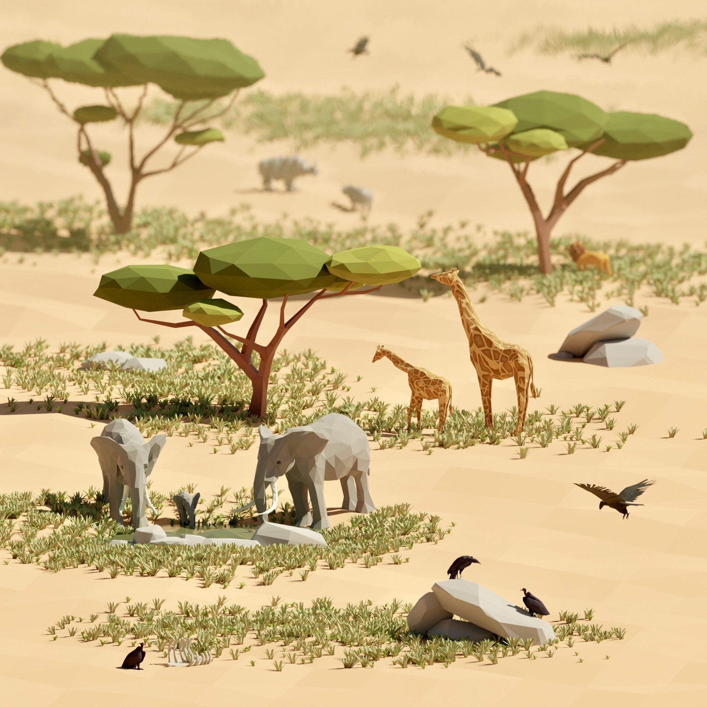

# EcoSim (_An ecosystem evolution simulation project_)

Art by [Thodoris Tsiridis](https://thodoris.artstation.com/) 
## Reference Sheet
This is a reference sheet for all custom types, files and directories and how data is utilized/passed between them.
### ./index.ts

- It describes all the types like **`Creature`**, **`Behavior`** etc.
- It for now also contains some necessary constants like **`directions[]`** which is basically falls under locomotive behavior of a creature, **`types[]`** which defines it's specie type etc.
- For specie types, there are as of now only 5 categories under which any creature falls namely:
    - a. `Bacteria`
    - b. `Insects`
    - c. `Fish`
    - d. `Birds`
    - e. `Mammals`

### ./randomString.ts
- It generates a random string containing upperCase, lowerCase and numeric values.
- This random string string is then utilized by the organism of type `Creature` to define its `organism.genome.keys` with an array consisting of random strings
- This helps in generating variety of creatures with varying genetic data per generation.

### ./firstGen.ts
- This script contains a functions which is used to generate the first generation of the ecosystem. (*as for now*)
- It initializes an **`organism[]`** of type `Creature` and generates random creatures with random respective traits.
